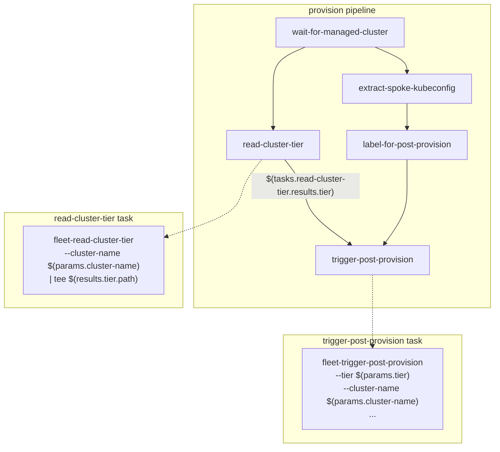
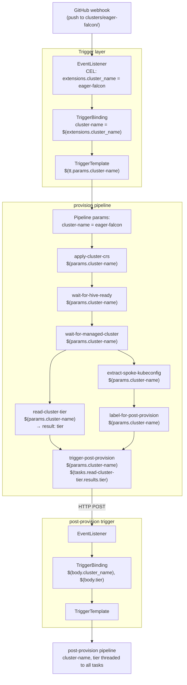

# Parameter Threading in Tekton Pipelines

## What is parameter threading?

Parameter threading is the practice of declaring a value at one level of the Tekton object hierarchy and explicitly passing it down through each successive level until it reaches the code that uses it. Tekton has no implicit inheritance — every parameter must be declared, mapped, and forwarded at each boundary. The "thread" is the chain of explicit `$(...)` references that carry a value from its origin to its destination.

In this project, a single value like `cluster-name` passes through five objects before it reaches the bash script that acts on it.

## Layers and syntax

Each layer in the Tekton trigger-to-task chain has its own substitution syntax:

| Layer | Object | Syntax | Example |
|-------|--------|--------|---------|
| Event extraction | EventListener | CEL expressions | `body.commits.map(c, ...)` |
| Binding | TriggerBinding | `$(body.X)`, `$(extensions.X)` | `$(extensions.cluster_name)` |
| Template | TriggerTemplate | `$(tt.params.X)` | `$(tt.params.cluster-name)` |
| Pipeline | Pipeline → Task | `$(params.X)` | `$(params.cluster-name)` |
| Task step | Task script | `$(params.X)` | `--cluster-name "$(params.cluster-name)"` |

Task results add a return path between tasks within a pipeline:

| Direction | Syntax | Example |
|-----------|--------|---------|
| Task writes result | `$(results.X.path)` | `tee "$(results.tier.path)"` |
| Pipeline reads result | `$(tasks.TASKNAME.results.X)` | `$(tasks.read-cluster-tier.results.tier)` |

## High-level flow

```mermaid
flowchart LR
    subgraph "Layer 1 — Event"
        EL[EventListener<br/>CEL interceptor]
    end

    subgraph "Layer 2 — Binding"
        TB[TriggerBinding<br/><code>$&#40;body.X&#41;</code><br/><code>$&#40;extensions.X&#41;</code>]
    end

    subgraph "Layer 3 — Template"
        TT[TriggerTemplate<br/><code>$&#40;tt.params.X&#41;</code>]
    end

    subgraph "Layer 4 — Pipeline"
        P[Pipeline<br/><code>$&#40;params.X&#41;</code>]
    end

    subgraph "Layer 5 — Task"
        T[Task step / script<br/><code>$&#40;params.X&#41;</code>]
    end

    Webhook -->|HTTP POST| EL
    EL -->|extensions overlay| TB
    TB -->|params| TT
    TT -->|PipelineRun| P
    P -->|task params| T
```



## Task result threading

Within a pipeline, one task can produce a result that a downstream task consumes. The pipeline acts as the intermediary — it reads the result from the producing task and maps it into the consuming task's params.



The `read-cluster-tier` task writes the tier label value to `$(results.tier.path)`. The pipeline references it as `$(tasks.read-cluster-tier.results.tier)` and passes it to `trigger-post-provision` as the `tier` param.

## Cross-pipeline threading

The provision pipeline does not just thread parameters within itself — it also forwards values to the post-provision pipeline by firing a webhook. The `trigger-post-provision` task sends an HTTP request with parameters in the JSON body. The post-provision EventListener trigger picks these up through a new TriggerBinding that reads `$(body.X)`.

```mermaid
flowchart LR
    subgraph "provision pipeline"
        RCT2[read-cluster-tier<br/>result: tier]
        TPP2[trigger-post-provision]
        RCT2 -->|"$(tasks...results.tier)"| TPP2
    end

    TPP2 -->|"HTTP POST<br/>{cluster_name, tier, base_domain, ...}"| EL2

    subgraph "post-provision trigger"
        EL2[EventListener<br/>filter: action == post-provision]
        TB2[TriggerBinding<br/><code>$&#40;body.tier&#41;</code>]
        TT2[TriggerTemplate<br/><code>$&#40;tt.params.tier&#41;</code>]
        EL2 --> TB2 --> TT2
    end

    TT2 -->|PipelineRun| PP[post-provision pipeline<br/><code>$&#40;params.tier&#41;</code>]
```



## Concrete example — tracing `cluster-name` end to end

### 1. EventListener extracts the cluster name

A git push webhook arrives. The CEL interceptor in `tekton/triggers/eventlistener.yaml` parses the commit's added files to find the cluster directory name:

```yaml
# eventlistener.yaml — CEL overlay
- key: cluster_name
  expression: >-
    body.commits.map(c, c.added.filter(f, f.startsWith('clusters/')))
    .flatten()
    .map(f, f.split('/')[1])
    .filter(n, n != '')
    [0]
```

If a commit adds `clusters/eager-falcon/cluster.yaml`, the overlay sets `extensions.cluster_name` to `eager-falcon`.

### 2. TriggerBinding maps it to a named param

`tekton/triggers/triggerbinding-pre-provision.yaml`:

```yaml
spec:
  params:
    - name: cluster-name
      value: $(extensions.cluster_name)
```

### 3. TriggerTemplate forwards it to the PipelineRun

`tekton/triggers/triggertemplate-pre-provision.yaml`:

```yaml
spec:
  params:
    - name: cluster-name
  resourcetemplates:
    - apiVersion: tekton.dev/v1
      kind: PipelineRun
      spec:
        params:
          - name: cluster-name
            value: $(tt.params.cluster-name)
```

### 4. Pipeline threads it to every task

`tekton/pipelines/provision.yaml`:

```yaml
spec:
  params:
    - name: cluster-name
      type: string
  tasks:
    - name: read-cluster-tier
      params:
        - name: cluster-name
          value: $(params.cluster-name)
```

Every task in the pipeline receives `cluster-name` the same way — `$(params.cluster-name)`.

### 5. Task uses it in the script

`tekton/tasks/read-cluster-tier.yaml`:

```yaml
spec:
  params:
    - name: cluster-name
      type: string
  results:
    - name: tier
  steps:
    - name: read-tier
      script: |
        #!/usr/bin/env bash
        set -euo pipefail
        fleet-read-cluster-tier --cluster-name "$(params.cluster-name)" \
          | tee "$(results.tier.path)"
```

At this point `cluster-name` has been threaded through five objects: EventListener → TriggerBinding → TriggerTemplate → Pipeline → Task.

### 6. Result feeds the next task

Back in `tekton/pipelines/provision.yaml`, the `tier` result threads into `trigger-post-provision`:

```yaml
    - name: trigger-post-provision
      params:
        - name: tier
          value: $(tasks.read-cluster-tier.results.tier)
        - name: cluster-name
          value: $(params.cluster-name)
```

Both pipeline-level params (`cluster-name`) and task results (`tier`) are threaded to this task, which forwards them to the post-provision pipeline via webhook.

## Full parameter lifecycle


